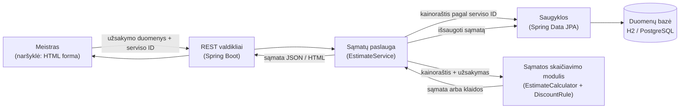

# Autoserviso sąmatų skaičiuoklė

Kursinio darbo I dalis: projektavimo dokumentas

## 1. Problema ir idėja

**Sistema vienu sakiniu:** internetinė sistema mažiems autoservisams, kuri pagal serviso kainoraštį, pasirinktus darbus ir detales automatiškai apskaičiuoja remonto sąmatą su nuolaidomis ir PVM, kad klientui kainą būtų galima pasakyti prieš pradedant darbus.

**Problema ir dabartinis procesas:** mažuose autoservisuose sąmata dažniausiai pildoma ant popierinio blanko: meistras ranka įrašo gedimą, kliento telefoną, automobilį, atliekamus darbus ir kainas, o sumą skaičiuoja skaičiuotuvu. Konkretūs trūkumai:

- tas pats darbas skirtingų meistrų įkainojamas skirtingai, nes normatyvinės valandos ir įkainis yra „galvoje“;
- kai keli darbai turi bendrą operaciją (pvz., ir kaladėlių, ir diskų keitimui reikia nuimti ratus), ji dažnai apmokestinama du kartus arba nuolaida taikoma „iš akies“;
- nuolatinio kliento nuolaida ir akcijos kartais sumuojamos, kartais ne – nėra vienos taisyklės;
- klientas nežino galutinės kainos su PVM, kol darbai neatlikti, todėl kyla ginčų dėl sumos.

**Nauda:** vienodai ir atkartojamai apskaičiuota kaina, aiški sąmatos eilučių struktūra (darbas, valandos, nuolaida, detalės, PVM), automatinis įspėjimas, kai sąmata viršija kliento nurodytą sumą, ir išsaugota sąmatų istorija.

**Naudotojai:**

- *Serviso meistras / administratorius* – sukuria sąmatą: pasirenka automobilio klasę, darbus iš sąrašo, įveda detales ir jų pirkimo kainas, nurodo, ar klientas nuolatinis, ir kliento kainos ribą; peržiūri ir išsaugo sąmatą.
- *Serviso savininkas* – tvarko savo serviso kainoraštį: valandinį įkainį, darbų normatyvus, detalių antkainį, akcijas.
- Sistema skirta keliems servisams (klientams): kiekvienas servisas mato tik savo kainoraštį ir sąmatas.

**Prielaidos:**

- *Žinoma:* popierinės sąmatos turinys (gedimas, kliento kontaktai, automobilis, darbai, kainos) ir tai, kad kaina skaičiuojama pagal darbo valandas ir detales.
- *Prielaida:* kiekvienas servisas pats nustato valandinį įkainį, darbų normatyvines valandas, detalių antkainį ir nuolaidas. Pavyzdžiuose naudojamos reikšmės (40 €/h, 20 % antkainis, 5 % nuolatinio kliento nuolaida, automobilių klasių koeficientai) yra projekto prielaidos, o ne realaus serviso duomenys.
- *Prielaida:* PVM tarifas – 21 % (standartinis LT tarifas); laikomas serviso konfigūracijoje, kad jį būtų galima pakeisti.
- *Prielaida:* kainos kainoraštyje nurodomos be PVM; valiuta – eurai.

## 2. Apimtis

| Funkcija | Ką naudotojas galės atlikti | Pagrindinis modulis ar pagalbinė funkcija |
|---|---|---|
| Sąmatos skaičiavimas | Pasirinkti darbus, detales, automobilio klasę, kliento tipą ir kainos ribą → gauti sąmatą su eilutėmis, nuolaidomis, PVM, galutine suma ir būsena | **Pagrindinis modulis** |
| Sąmatos išsaugojimas ir peržiūra | Išsaugoti apskaičiuotą sąmatą ir vėliau ją peržiūrėti pagal numerį | Pagalbinė |
| Serviso kainoraštis | Peržiūrėti darbų sąrašą su normatyvinėmis valandomis ir akcijomis (prototipe – iš anksto užpildytas) | Pagalbinė |
| Kelių servisų atskyrimas | Dirbti tik savo serviso kontekste: kito serviso kainoraštis ir sąmatos nepasiekiami | Pagalbinė (privaloma II etapui) |

**Į kursinio darbo apimtį neįeina:** sąskaitų faktūrų išrašymas ir apskaita, mokėjimai, detalių sandėlio likučių valdymas, detalių kainų gavimas iš tiekėjų, darbų laiko planavimas (meistrų užimtumas), SMS / el. pašto pranešimai klientams, mobilioji programėlė, savitarnos registracija. Kainoraščio redagavimo forma – tik jei liks laiko; prototipe kainoraštis įkeliamas iš pradinių duomenų.

## 3. Pagrindinis modulis

**Pavadinimas ir atsakomybė:** *Sąmatos skaičiavimo modulis* (`EstimateCalculator`). Iš serviso kainoraščio ir užsakymo duomenų apskaičiuoja sąmatą: koreguoja bendrų operacijų valandas, pritaiko automobilio klasės koeficientą, parenka nuolaidą kiekvienai darbo eilutei, apskaičiuoja detalių kainas, PVM ir nustato sąmatos būseną pagal kliento kainos ribą. Modulis nežino nieko apie duomenų bazę ar naudotojo sąsają – gauna duomenis ir grąžina rezultatą.

**Logika, kurią reikės projektuoti ir testuoti:** bendrų operacijų konfliktų sprendimas, valandų apvalinimas, vienos (didžiausios) nuolaidos parinkimas iš kelių galimų, pinigų apvalinimas iki centų, PVM skaičiavimas, kainos ribos patikra ir neteisingos įvesties atmetimas.

**Įvestis:**

- serviso kainoraštis: valandinis įkainis, detalių antkainis, nuolatinio kliento nuolaida, PVM tarifas, automobilių klasių koeficientai, darbų sąrašas;
- užsakymas: automobilio klasė, ar klientas nuolatinis, darbų kodai, detalės (pavadinimas, pirkimo kaina be PVM, kiekis), neprivaloma kliento kainos riba (su PVM).

Pavyzdinis serviso „Autoservisas Alfa“ kainoraštis (naudojamas visuose pavyzdžiuose ir testuose):

| Parametras | Reikšmė |
|---|---|
| Valandinis įkainis | 40,00 €/h be PVM |
| Detalių antkainis | 20 % |
| Nuolatinio kliento nuolaida (tik darbams) | 5 % |
| PVM | 21 % |
| Automobilio klasės koeficientas | LENGVASIS 1,00; VISUREIGIS 1,20; MIKROAUTOBUSAS 1,30 |

| Kodas | Darbas | Normatyvas | Bendra operacija | Akcija |
|---|---|---|---|---|
| D01 | Priekinių stabdžių kaladėlių keitimas | 1,0 h | PRIEKINIAI_RATAI (0,4 h) | – |
| D02 | Priekinių stabdžių diskų keitimas | 1,6 h | PRIEKINIAI_RATAI (0,4 h) | – |
| D03 | Variklio alyvos ir filtro keitimas | 0,5 h | – | – |
| D05 | Kompiuterinė diagnostika | 0,5 h | – | 20 % |

Antrasis servisas „Autoservisas Beta“ turi kitą kainoraštį (pvz., 45 €/h, darbai su kodais B01–B05) – jis naudojamas klientų atskyrimui tikrinti.

Užsakymo pavyzdys (JSON): `{"carClass": "LENGVASIS", "regularCustomer": false, "workCodes": ["D01", "D03"], "parts": [{"name": "Stabdžių kaladėlės", "unitCost": 30.00, "qty": 1}, {"name": "Alyva 5W-30, l", "unitCost": 8.00, "qty": 4}, {"name": "Alyvos filtras", "unitCost": 6.50, "qty": 1}], "priceLimit": null}`

**Išvestis:** sąmata su darbo eilutėmis (kodas, apmokestinamos valandos, kaina, taikyta nuolaida, kaina po nuolaidos), detalių eilutėmis, sumomis ir būsena. Pavyzdžiui, aukščiau pateiktam užsakymui: darbai 60,00 €, detalės 82,20 €, suma be PVM 142,20 €, PVM 29,86 €, iš viso 172,06 €, būsena `PARENGTA`.

**Veikimo eiga:**

1. Patikrinama įvestis (R8). Radus klaidą – grąžinamas klaidos pranešimas, sąmata nesukuriama.
2. Kiekvienam darbui paimamas normatyvas iš kainoraščio ir išsprendžiamos bendros operacijos (R1).
3. Valandos padauginamos iš klasės koeficiento ir suapvalinamos (R2), apskaičiuojama darbo eilutės kaina (R3).
4. Kiekvienai darbo eilutei parenkama viena nuolaida (R4).
5. Apskaičiuojamos detalių eilutės (R5).
6. Apskaičiuojama suma be PVM, PVM ir galutinė suma (R6).
7. Galutinė suma palyginama su kliento kainos riba ir nustatoma būsena (R7).

### Taisyklės arba sprendimo žingsniai

1. **R1 – bendros operacijos.** Jei du ar daugiau pasirinktų darbų turi tą pačią bendrą operaciją, jos valandos paliekamos tik darbe su didžiausiu normatyvu (lygybės atveju – darbe su mažesniu kodu pagal abėcėlę). Iš kitų darbų normatyvo operacijos valandos atimamos. Pvz., D01 + D02: D02 lieka 1,6 h, D01 tampa 1,0 − 0,4 = 0,6 h.
2. **R2 – apmokestinamos valandos.** Apmokestinamos valandos = koreguotas normatyvas × automobilio klasės koeficientas, suapvalinta **į didesnę pusę** iki 0,1 h. Pvz., 0,6 × 1,20 = 0,72 → 0,8 h.
3. **R3 – darbo eilutės kaina.** Kaina = apmokestinamos valandos × valandinis įkainis. Visi pinigų skaičiavimai atliekami dešimtainiais skaičiais (`BigDecimal`), kiekviena tarpinė suma apvalinama iki 0,01 € **įprastu būdu** (0,005 → 0,01, `HALF_UP`).
4. **R4 – nuolaidos nesumuojamos.** Kiekvienai darbo eilutei taikoma tik viena nuolaida – didžiausia iš tinkamų: darbo akcija (jei yra) ir nuolatinio kliento nuolaida (jei klientas nuolatinis). Nuolaidos suma apvalinama pagal R3. Detalėms nuolaidos netaikomos.
5. **R5 – detalės.** Detalės eilutės kaina = pirkimo kaina × (1 + antkainis) × kiekis, suapvalinta pagal R3. Kiekis – sveikas skaičius arba litrai su dviem skaitmenimis po kablelio.
6. **R6 – PVM.** Suma be PVM = darbo eilučių (po nuolaidų) ir detalių eilučių suma. PVM = suma be PVM × PVM tarifas, suapvalinta pagal R3. Iš viso = suma be PVM + PVM.
7. **R7 – kainos riba.** Jei kliento kainos riba nurodyta ir „iš viso“ yra **didesnė** už ribą, sąmatos būsena `LAUKIA_PATVIRTINIMO` ir nurodoma, kiek riba viršyta. Jei „iš viso“ lygi ribai, mažesnė arba riba nenurodyta – būsena `PARENGTA`.
8. **R8 – įvesties patikra.** Sąmata nesukuriama, jei: nepasirinktas nė vienas darbas; darbo kodo nėra *esamo serviso* kainoraštyje (kito serviso kodas laikomas nežinomu); tas pats darbo kodas nurodytas du kartus; detalės kiekis ≤ 0 arba pirkimo kaina < 0; nežinoma automobilio klasė. Grąžinami visi rasti klaidų pranešimai, nieko neišsaugoma.

### Scenarijai būsimiems testams

Visi scenarijai vykdomi „Autoservisas Alfa“ kontekste su aukščiau pateiktu kainoraščiu.

| Scenarijus | Pradinės sąlygos ir konkreti įvestis | Veiksmas | Tikslus laukiamas rezultatas |
|---|---|---|---|
| Įprastas atvejis | LENGVASIS, nenuolatinis klientas, darbai D01, D03; detalės: kaladėlės 30,00 € × 1, alyva 8,00 € × 4, filtras 6,50 € × 1; riba nenurodyta | Apskaičiuoti sąmatą | D01: 1,0 h → 40,00 €; D03: 0,5 h → 20,00 €; nuolaidų nėra. Detalės: 36,00 + 38,40 + 7,80 = 82,20 €. Suma be PVM 142,20 €, PVM 29,86 €, **iš viso 172,06 €**, būsena `PARENGTA` |
| Ribinis atvejis – riba lygi sumai | Tas pats užsakymas, kliento riba 172,06 € | Apskaičiuoti sąmatą | Iš viso 172,06 €, būsena `PARENGTA` (lygybė ribos neviršija) |
| Konfliktas – bendra operacija, kelios nuolaidos, riba viršyta | VISUREIGIS, nuolatinis klientas, darbai D01, D02, D05; detalės: kaladėlės 30,00 € × 1, diskai 45,00 € × 2; kliento riba 250,00 € | Apskaičiuoti sąmatą | R1: D01 → 0,6 h, D02 lieka 1,6 h. R2: D01 0,72 → 0,8 h; D02 1,92 → 2,0 h; D05 0,6 h. R3: 32,00 / 80,00 / 24,00 €. R4: D01 −5 % → 30,40 €; D02 −5 % → 76,00 €; D05 −20 % (akcija didesnė už 5 %) → 19,20 €. Darbai 125,60 €, detalės 36,00 + 108,00 = 144,00 €. Suma be PVM 269,60 €, PVM 56,62 €, **iš viso 326,22 €**, būsena `LAUKIA_PATVIRTINIMO`, riba viršyta 76,22 € |
| Klaida – kito serviso darbas | Darbai D01 ir B03 (B03 yra tik „Autoservisas Beta“ kainoraštyje); detalė: kaladėlės 30,00 € × 0 | Apskaičiuoti sąmatą | Sąmata nesukuriama, grąžinamos 2 klaidos: „Nežinomas darbo kodas: B03“ ir „Detalės „Stabdžių kaladėlės“ kiekis turi būti didesnis už 0“. Duomenų bazėje naujų įrašų neatsiranda |

**Jei modulis naudoja AI:** Netaikoma.

## 4. Kokybės atributas

### 4.1. Palaikomumas (keičiamumas)

**Pasirinktas atributas:** palaikomumas – naujos nuolaidos taisyklės pridėjimas.

**Kodėl svarbus šiai sistemai:** servisų akcijos ir nuolaidų sąlygos keičiasi dažnai (sezoninės akcijos, nuolaidos dideliems užsakymams). Jei kiekviena nauja nuolaida reikalautų keisti pagrindinį skaičiavimą, kiltų rizika sugadinti jau veikiančias taisykles ir sąmatų sumas.

**Tikrinimo scenarijus ir sąlygos:** pridedama nauja taisyklė **„Didelio užsakymo nuolaida“**: jei visų darbo eilučių apmokestinamų valandų suma (po R1 ir R2) yra **≥ 3,0 h**, kiekvienai darbo eilutei tampa tinkama 10 % nuolaida. Ji nesumuojama su kitomis – pagal R4 taikoma didžiausia iš tinkamų nuolaidų. Pavyzdys: 3 skyriaus konflikto scenarijuje valandų suma 0,8 + 2,0 + 0,6 = 3,4 h, todėl D01 ir D02 vietoj 5 % gauna 10 % (28,80 € ir 72,00 €), o D05 lieka su 20 % akcija (19,20 €). Darbai 120,00 €, suma be PVM 264,00 €, PVM 55,44 €, iš viso 319,44 €.

**Sėkmės kriterijus:** naujai taisyklei pridėti pakeičiami ar sukuriami tik šie failai: nauja taisyklės klasė, jos testų klasė ir serviso konfigūracija (taisyklės įjungimas). Esamos nuolaidų taisyklių klasės ir `EstimateCalculator` nekeičiami (`git diff --stat` tarp dviejų komitų rodo tik minėtus failus). Visi ankstesni testai praeina nepakeisti, o 2 nauji testai praeina: (a) aukščiau pateiktas pavyzdys – 3,4 h, iš viso 319,44 €; (b) tas pats užsakymas, bet automobilis LENGVASIS – valandų suma 0,6 + 1,6 + 0,5 = 2,7 h < 3,0 h, todėl 10 % netaikoma: D01 22,80 €, D02 60,80 € (po 5 %), D05 16,00 € (20 % akcija), darbai iš viso 99,60 €.

**Numatytas projektavimo sprendimas:** kiekviena nuolaida realizuojama kaip atskira klasė, įgyvendinanti bendrą sąsają `DiscountRule` (metodas grąžina tinkamą nuolaidos procentą darbo eilutei arba „netinka“). `EstimateCalculator` gauna taisyklių sąrašą ir tik parenka didžiausią reikšmę (R4) – jis nežino, kokios konkrečios taisyklės egzistuoja („strategijos“ šablonas). Kurias taisykles naudoja servisas, nurodoma konfigūracijoje.

**Kaip patikrinsiu vėlesniame etape:** III etape pademonstruosiu pakeitimą atskiru komitu: parodysiu `git diff --stat`, paleisiu visą testų rinkinį (`mvn test`) ir naujus testus.

**Sprendimo kaina arba ribojimas:** daugiau klasių ir viena papildoma abstrakcija, nei reikėtų vienai `if` sakinių grandinei. Sprendimas tinka tik toms nuolaidoms, kurios taikomos darbo eilutei; nuolaidai visai sąmatai (pvz., „−10 € nuo sumos“) reikėtų kitokios sąsajos ir pakeisti skaičiavimą.

### 4.2. Saugumas – servisų duomenų atskyrimas (papildomas)

**Kodėl svarbus:** sistema bendra keliems servisams; vieno serviso kainos ir klientų sąmatos neturi būti matomos konkurentui.

**Tikrinimo scenarijus ir sąlygos:** duomenų bazėje yra „Alfa“ ir „Beta“ servisai ir po 3 sąmatas. „Alfa“ kontekste bandoma (1) gauti „Beta“ sąmatą pagal jos ID, (2) apskaičiuoti sąmatą su „Beta“ darbo kodu, (3) pakeisti „Beta“ sąmatą.

**Sėkmės kriterijus:** (1) ir (3) grąžina „nerasta“ (HTTP 404), „Beta“ duomenys nepasikeičia; (2) grąžina klaidą „Nežinomas darbo kodas“. Sąmatų sąrašas „Alfa“ kontekste grąžina lygiai 3 įrašus.

**Numatytas projektavimo sprendimas:** kiekvienas kainoraščio ir sąmatos įrašas turi `tenant_id`; visi saugyklos metodai priima serviso ID ir filtruoja pagal jį (nėra metodo „rasti pagal ID“ be serviso ID). Prototipe servisas nustatomas iš užklausos antraštės, III etape – iš prisijungusio naudotojo.

**Kaip patikrinsiu:** automatiniu integraciniu testu (II etape privalomas klientų izoliavimo testas).

**Sprendimo kaina arba ribojimas:** filtravimą reikia nepamiršti kiekviename naujame užklausos metode; prototipe antraštę gali pakeisti bet kas, todėl tikra apsauga atsiras tik su prisijungimu III etape.

## 5. Pradinė sistemos struktūra

### Paprasta schema

| Sistemos dalis | Atsakomybė |
|---|---|
| Naudotojo sąsaja (paprasta HTML forma arba Postman / curl) | Leidžia pasirinkti darbus ir įvesti detales, parodo sąmatą arba klaidų sąrašą |
| REST valdikliai | Priima užklausas, nustato serviso (kliento) kontekstą, paverčia JSON į užsakymo objektą ir atgal |
| Sąmatų paslauga | Sujungia žingsnius: įkelia serviso kainoraštį, kviečia skaičiavimo modulį, išsaugo sąmatą |
| Sąmatos skaičiavimo modulis | Visa verslo logika (R1–R8), gryna Java be Spring ir DB priklausomybių – todėl lengvai testuojama |
| Saugyklos ir duomenų bazė | Saugo servisus, kainoraščius ir sąmatas; visos užklausos filtruojamos pagal serviso ID |

**Planuojamos technologijos ir pasirinkimo priežastys:**

- **Java 21** – kalba, kurios mokausi ir kurią naudosiu ateityje; `BigDecimal` tinka tiksliems pinigų skaičiavimams.
- **Spring Boot 3 (Web, Data JPA)** – greitai sukuriamas REST API ir prisijungimas prie DB, daug mokymosi medžiagos; vėliau (III etape) galima pridėti Spring Security.
- **H2** (prototipe, failinė DB) – nereikia atskirai diegti duomenų bazės, prototipas paleidžiamas viena komanda; vėliau galima pereiti prie **PostgreSQL**.
- **JUnit 5** – pagrindinio modulio ir izoliacijos testai; **Maven** – kūrimas ir testų paleidimas (`mvn test`, `mvn spring-boot:run`).
- **GitHub** – kodo ir dokumentacijos saugojimas.

## 6. AI panaudojimas

### AI rengiant šį dokumentą

AI naudotas.

| Priemonė ir užduotis | Ką panaudojau | Ką atmečiau arba perrašiau ir kodėl | Kaip patikrinau |
|---|---|---|---|
| Claude (Anthropic) – temos pasirinkimas ir dokumento struktūra pagal šabloną | Pasiūlymą rinktis autoserviso sąmatą (žinau realų popierinės sąmatos procesą), dokumento juodraštį pagal šablono skyrius | Atmečiau papildomas taisykles (kliento atsineštos detalės, minimalus užsakymo laikas, sąmatos nuolaida nuo sumos), kad pagrindinis modulis tilptų į prototipą; nuolaidos nuo sumos atvejį palikau tik kaip sprendimo ribojimą 4 skyriuje | Kiekvieną taisyklę perskaičiau ir įsitikinau, kad galiu ją paaiškinti; palyginau su tuo, kaip pildoma popierinė sąmata |
| Claude – testų scenarijų skaičiavimai | Pavyzdžių sumas (172,06 €, 326,22 €, 319,44 €) | Apvalinimo taisyklę pasirinkau vieną (`HALF_UP` iki centų, valandos į didesnę pusę iki 0,1 h) ir pritaikiau visiems pavyzdžiams vienodai | Sumas perskaičiavau ranka ir atskiru Python skriptu su `Decimal` (tas pats apvalinimas kaip planuojamas Java kode) |

### Planuojamas AI naudojimas kuriant sistemą

**Kur ir kam naudosiu AI:** Spring Boot konfigūracijos ir JPA klausimams, klaidų pranešimų aiškinimui, testų idėjoms ir README juodraščiui. Verslo taisykles (R1–R8) rašysiu pats, nes jas turiu mokėti paaiškinti ir pakeisti atsiskaitymo metu.

**Kaip tikrinsiu pasiūlymus ir sugeneruotą kodą:** AI sugeneruotą kodą įtrauksiu tik jį perskaitęs ir supratęs; kiekvienai taisyklei pirmiau parašysiu testą su tiksliu laukiamu rezultatu iš 3 skyriaus, o kodą laikysiu tinkamu tik tada, kai visi testai praeina. Pinigų skaičiavimuose tikrinsiu, kad nenaudojamas `double`.

**Ar AI bus sistemos funkcionalumo dalis:** Ne.

## 7. Tolesnių darbų planas

| Darbas | Apčiuopiamas rezultatas | Planuojama darbų seka |
|---|---|---|
| 1. Skaičiavimo modulis grynoje Java | `EstimateCalculator`, `DiscountRule` ir taisyklės R1–R8; JUnit testai visiems 3 skyriaus scenarijams praeina | Pirmas – nuo jo priklauso viskas kita |
| 2. Duomenų modelis ir pradiniai duomenys | JPA esybės `Tenant`, `PriceList`, `WorkItem`, `Estimate` su `tenant_id`; „Alfa“ ir „Beta“ kainoraščiai įkeliami paleidus programą | Po 1 darbo |
| 3. REST API | `POST /api/estimates` (skaičiuoti ir išsaugoti), `GET /api/estimates/{id}`, `GET /api/works`; klaidos grąžinamos kaip HTTP 400 su pranešimų sąrašu | Po 2 darbo |
| 4. Klientų atskyrimas ir jo testas | Serviso nustatymas iš antraštės `X-Tenant-Id`, integracinis testas iš 4.2 skyriaus | Kartu su 3 darbu |
| 5. Paprasta sąsaja ir README | HTML forma sąmatai sudaryti; README su įrankių versijomis, paleidimo (`mvn spring-boot:run`) ir testų komandomis bei demonstracijos žingsniais | Paskutinis prieš II etapo atsiskaitymą |

**Būsimo prototipo veikimo scenarijus:** „Autoservisas Alfa“ kontekste meistras pasirenka VISUREIGIS, pažymi nuolatinį klientą, darbus D01, D02, D05, įveda detales (kaladėlės 30,00 € × 1, diskai 45,00 € × 2) ir kainos ribą 250,00 €. Sistema parodo eilutes su koreguotomis valandomis ir nuolaidomis, sumą be PVM 269,60 €, PVM 56,62 €, iš viso 326,22 € ir būseną „Laukia kliento patvirtinimo (viršyta 76,22 €)“. Po to parodysiu klaidos atvejį (darbas B03 iš „Beta“ kainoraščio → klaida, sąmata neišsaugota) ir kad „Beta“ sąmatos „Alfa“ kontekste nepasiekiamos.

| Rizika arba neaiškumas | Kaip patikrinsiu arba sumažinsiu |
|---|---|
| Pinigų apvalinimo klaidos (centų neatitikimai tarp eilučių ir sumos) | Visur `BigDecimal` ir viena apvalinimo vieta; testai tikrina tikslias sumas iki cento, įskaitant 0,005 € atvejį |
| Mažai patirties su Spring Boot – gali užtrukti konfigūracija | Pirmiausia sukuriu ir ištestuoju modulį be Spring (1 darbas), tada pridedu minimalų Spring Boot projektą iš Spring Initializr ir plečiu mažais žingsniais |
| Bendrų operacijų ir normatyvų duomenys sugalvoti, realiame servise gali skirtis | Prieš II etapą pasitikrinsiu su realaus autoserviso darbuotoju bent 5 dažniausius darbus; jei taisyklė R1 neatitinka praktikos, ją pakeisiu ir aprašysiu pakeitimą galutiniame etape |

## Šaltiniai, jei naudojote

- Asmeninės žinios apie popierinės autoserviso sąmatos pildymą (gedimas, kliento kontaktai, automobilis, atlikti darbai, kainos).
- Lietuvos Respublikos pridėtinės vertės mokesčio įstatymas – standartinis 21 % PVM tarifas.
- Java `BigDecimal` dokumentacija (Oracle) – `RoundingMode.HALF_UP` ir `CEILING` apvalinimas.
- AI naudojimas aprašytas 6 skyriuje.
